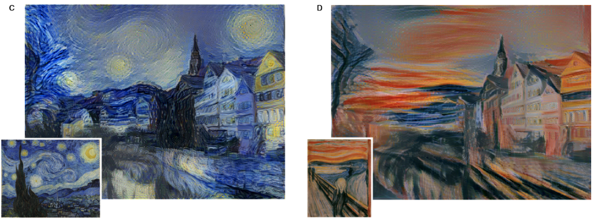
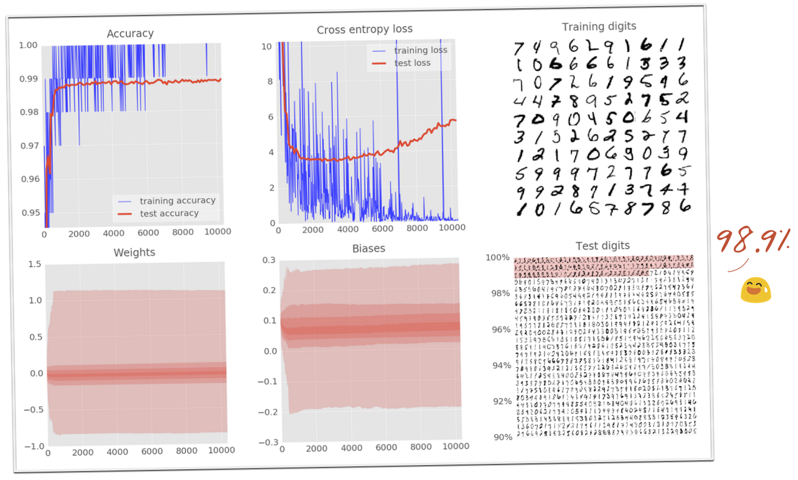

<!-- slide -->
## Introduction to Deep Learning

> by **Ray Cai**
> from **PMC, ISG, ICG**

<!-- slide -->
## Agenda

1. Application Areas
2. Approaches

<!-- slide -->
## Application Areas

* Speech Recognition
* Image Recognition
* Natural Language Processing
* Visual Art Processing
* Bioinformatics

<!-- slide -->
## Speech Recognition

* [Google Speech API](https://cloud.google.com/speech/)
<!-- slide -->
## Speech Recognition

**$1.44 per Hour**

* [Google Speech API](https://cloud.google.com/speech/)

<!-- slide -->
## Image Recognition

* [Detect Faces and Emotions](https://developers.google.com/vision/)
<!-- slide -->
## Image Recognition

* [Google Cloud Vision API enters Beta, open to all to try!](https://cloudplatform.googleblog.com/2016/02/Google-Cloud-Vision-API-enters-beta-open-to-all-to-try.html)

<!-- slide -->
## Image Recognition

* [Google Cloud Vision API enters Beta, open to all to try!](https://cloudplatform.googleblog.com/2016/02/Google-Cloud-Vision-API-enters-beta-open-to-all-to-try.html)

<!-- slide -->
## Natural Language Processing

* [Google Natural Language API](https://cloud.google.com/natural-language/)

<!-- slide -->
## Natural Language Processing

* [Google Natural Language API](https://cloud.google.com/natural-language/)

<!-- slide -->
## Visual Art Processing

* [A Neural Algorithm of Artistic Style](https://arxiv.org/abs/1508.06576)
<!-- slide -->
## Visual Art Processing

* [A Neural Algorithm of Artistic Style](https://arxiv.org/abs/1508.06576)
<!-- slide -->
## Visual Art Processing

* [A Neural Algorithm of Artistic Style](https://arxiv.org/abs/1508.06576)

<!-- slide -->
## Approaches

<!-- slide -->
## Deep Learning

* Machine Learning
  * Support Vector Machine
  * Artificial Neural Network
    * **Deep learning**
  * Decision Tree
  * ...

<!-- slide -->
## Artificial Neural Network

<!-- slide -->
## Biological Neuron

<!-- slide -->
## Mathematical Neuron

$$
f = \psi(\sum(X \times W + b))
$$

<!-- slide -->
## Neural Network

 

<!-- slide -->
## Handwritten Digits Classification

<!-- slide -->
## 1-Layer Neural Network

<!-- slide -->
## 1-Layer Neural Network - Weight

$$
W = 
\begin{bmatrix}
w_{0,0} & w_{0,1} & w_{0,2} & w_{0,3} & ... & w_{0,9} \\
w_{1,0} & w_{1,1} & w_{1,2} & w_{1,3} & ... & w_{1,9} \\
w_{2,0} & w_{2,1} & w_{2,2} & w_{2,3} & ... & w_{2,9} \\
w_{3,0} & w_{3,1} & w_{3,2} & w_{3,3} & ... & w_{3,9} \\
... \\
w_{783,0} & w_{783,1} & w_{783,2} & w_{783,3} & ... & w_{783,9} 
\end{bmatrix}
$$

<!-- slide -->
## 1-Layer Neural Network - Activation Function

$$
\psi = softmax(L_n) = \frac{e^{L_n}}{||e^L||}
$$

<!-- slide -->
## 1- Layer Neural Network - Formula

<!-- slide -->
## 1- Layer Neural Network - Loss Function

<!-- slide -->
## Mathematical Problem

**Known:**

$$
Y = softmax(X.W+b)
$$

$$
L = -\Sigma{Y'_i.log(Y_i)}
$$

**Adjust $W$ and $b$ minimise $L$**

<!-- slide -->
## Gradient Descent

<!-- slide -->
## Accuracy

<!-- slide -->
## Deep Neural Network

<!-- slide -->
## Mathematical Problem

$$
T_1 = sigmoid(X.W_1+b_1) \\
T_2 = sigmoid(T_1.W_2+b_2) \\
T_3 = sigmoid(T_2.W_2+b_2) \\
T_4 = sigmoid(T_3.W_3+b_3) \\
Y = sigmoid(T_4.W_4+b_4)
$$

$$
L = -\Sigma{Y'_i.log(Y_i)}
$$

<!-- slide -->
## Accuracy

<!-- slide -->
## More Complex Neural Network

* Convolutional networks

<!-- slide -->
## Convolutional Networks

<!-- slide -->
## Accuracy

<!-- slide -->
## Reference

1. [TensorFlow and deep learning, without a PhD](https://codelabs.developers.google.com/codelabs/cloud-tensorflow-mnist)
2. [Deep Learning](https://en.wikipedia.org/wiki/Deep_learning)

<!-- slide -->
## Q&A

<!-- slide -->
## Thank You