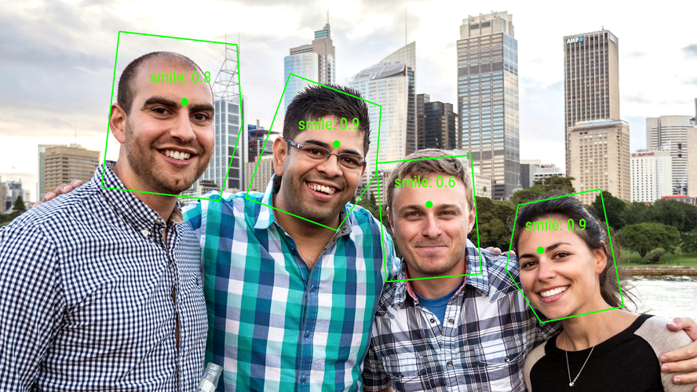
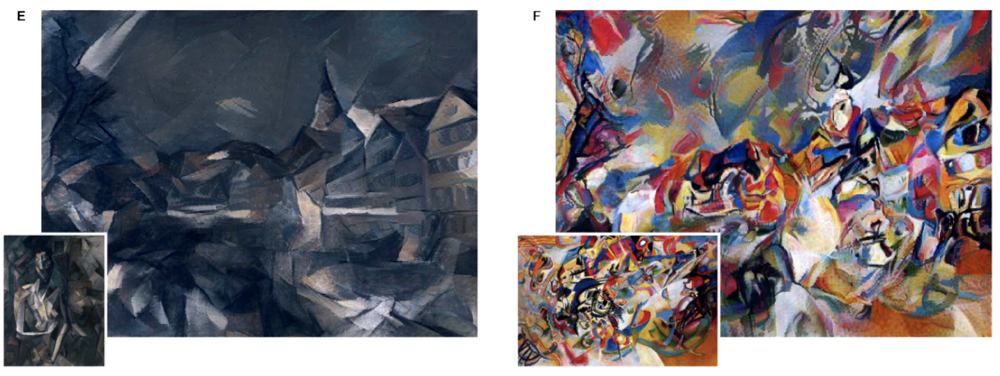
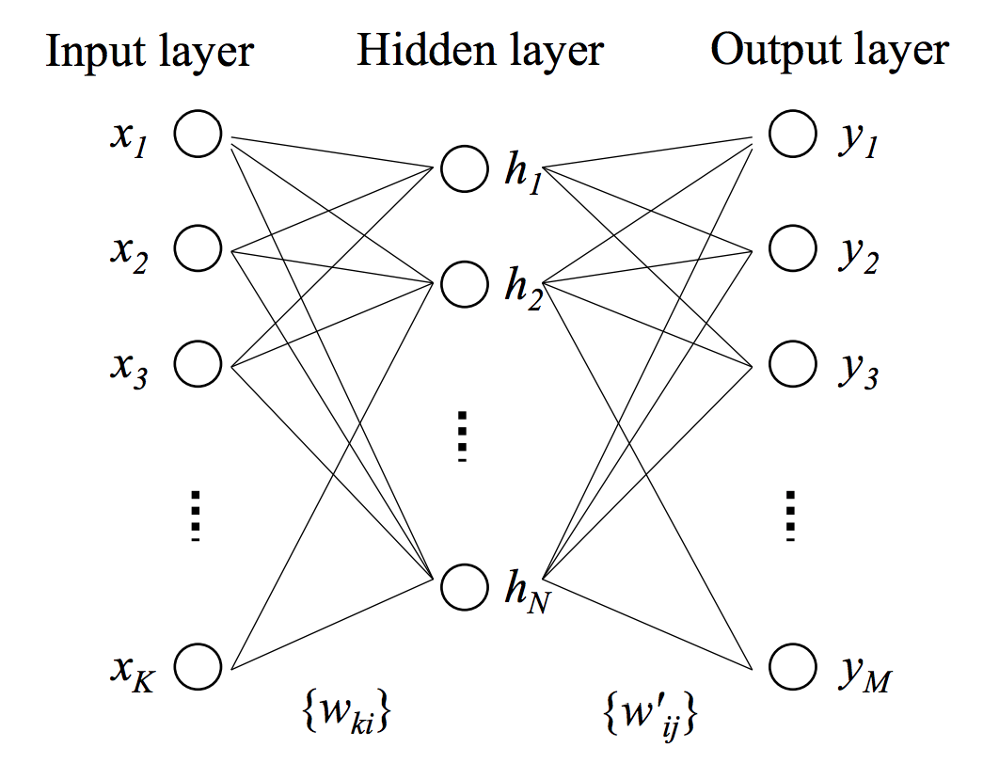
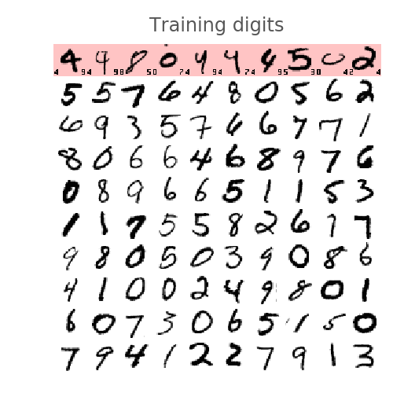

<style type="text/css">
  .reveal section img {
    background-color: white !important;
    max-height: 600px !important;
  }
  .reveal h2 {
    text-align: left;
  }
  .reveal p {
    text-align: left;
  }
  .reveal ul {
    display: block;
  }
  .reveal ol {
    display: block;
  }
  p.diagram {
    color: #abb2bf;
    background-color: #31363f !important;
    border: #4b5362;
    border-radius: 3px;
  }
</style>

<!-- slide -->
## Introduction to Deep Learning

> by **Ray Cai (LC85640)**
> from **PMC, ISG, ICG**

<!-- slide -->
## Agenda

1. Application Areas
2. Technology

<!-- slide -->
## Application Areas

* Speech Recognition
* Image Recognition
* Natural Language Processing
* Visual Art Processing
* Bioinformatics

<!-- slide -->
## Google Speech Recognition


<!-- slide -->
## Google Speech Recognition


**$1.44 per Hour**

* [CLOUD SPEECH API](https://cloud.google.com/speech/)

<!-- slide -->
## Image Recognition



* [Detect Faces and Emotions](https://developers.google.com/vision/)
<!-- slide -->
## Image Recognition


* [Google Cloud Vision API enters Beta, open to all to try!](https://cloudplatform.googleblog.com/2016/02/Google-Cloud-Vision-API-enters-beta-open-to-all-to-try.html)

<!-- slide -->
## Image Recognition


* [Google Cloud Vision API enters Beta, open to all to try!](https://cloudplatform.googleblog.com/2016/02/Google-Cloud-Vision-API-enters-beta-open-to-all-to-try.html)

<!-- slide -->
## Natural Language Processing


* [Google Natural Language API](https://cloud.google.com/natural-language/)

<!-- slide -->
## Natural Language Processing


* [Google Natural Language API](https://cloud.google.com/natural-language/)

<!-- slide -->
## Visual Art Processing


* [A Neural Algorithm of Artistic Style](https://arxiv.org/abs/1508.06576)
<!-- slide -->
## Visual Art Processing


* [A Neural Algorithm of Artistic Style](https://arxiv.org/abs/1508.06576)
<!-- slide -->
## Visual Art Processing



* [A Neural Algorithm of Artistic Style](https://arxiv.org/abs/1508.06576)

<!-- slide -->
## Technology

<!-- slide -->
## Deep Learning

* Machine Learning
  * Support Vector Machine
  * Artificial Neural Network
    * **Deep learning**
  * Decision Tree
  * ...

<!-- slide -->
## Supervised Learning

* Given a set of ${\displaystyle N}$ training examples of the form ${\displaystyle \{(x_{1},y_{1}),...,(x_{N},\;y_{N})\}} \{(x_1, y_1), ..., (x_N,\; y_N)\}$
* Define a scoring function ${\displaystyle f:X\times Y\to {\mathbb {R}}}$
* Seek a function ${\displaystyle g:X\to Y}$, which returning the ${\displaystyle y}$ value that gives the highest score: ${\displaystyle g(x)={\underset {y}{\arg \max }}\;f(x,y)}$.

<!-- slide -->
## Linear Regression


<!-- slide -->
## Linear Regression
$$
g = \beta_0 + \beta_1 \times X \\
f = \sum_{i=1}^{N} (g(x_i)-Y_i)^2
$$

Seek $\beta_0$ and $\beta_1$, which minimize $f$

$$
\begin{equation}
\begin{split}
f & = \sum(\beta_0 + 
\begin{bmatrix}
x_1 \\
x_2 \\
x_3 \\
... \\
x_n
\end{bmatrix}
\times \beta_1 - 
\begin{bmatrix}
y_1 \\
y_2 \\
y_3 \\
... \\
y_n
\end{bmatrix}
)^2 \\
  & = ?
\end{split}
\end{equation}
$$

<!-- slide -->
## Artificial Neural Network

<!-- slide -->
## Biological Neuron


<!-- slide -->
## Mathematical Neuron


$$
f = \psi(\sum(X \times W + b))
$$

<!-- slide -->
## Neural Network

 

<!-- slide -->
## Handwritten Digits Classification



<!-- slide -->
## 1-Layer Neural Network


<!-- slide -->
## 1-Layer Neural Network - Weight

$$
W = 
\begin{bmatrix}
w_{0,0} & w_{0,1} & w_{0,2} & w_{0,3} & ... & w_{0,9} \\
w_{1,0} & w_{1,1} & w_{1,2} & w_{1,3} & ... & w_{1,9} \\
w_{2,0} & w_{2,1} & w_{2,2} & w_{2,3} & ... & w_{2,9} \\
w_{3,0} & w_{3,1} & w_{3,2} & w_{3,3} & ... & w_{3,9} \\
... \\
w_{783,0} & w_{783,1} & w_{783,2} & w_{783,3} & ... & w_{783,9} 
\end{bmatrix}
$$

<!-- slide -->
## 1-Layer Neural Network - Activation Function

$$
\psi = softmax(L_n) = \frac{e^{L_n}}{||e^L||}
$$

<!-- slide -->
## 1- Layer Neural Network - Formula


<!-- slide -->
## 1- Layer Neural Network - Loss Function


<!-- slide -->
## Gradient Descent


<!-- slide -->
## Code
```python
import tensorflow as tf

X = tf.placeholder(tf.float32, [None, 28, 28, 1])
W = tf.Variable(tf.zeros([784, 10]))
b = tf.Variable(tf.zeros([10]))

init = tf.initialize_all_variables()
```
```python
# model
Y = tf.nn.softmax(tf.matmul(tf.reshape(X, [-1, 784]), W) + b)
# placeholder for correct labels
Y_ = tf.placeholder(tf.float32, [None, 10])

# loss function
cross_entropy = -tf.reduce_sum(Y_ * tf.log(Y))

# % of correct answers found in batch
is_correct = tf.equal(tf.argmax(Y,1), tf.argmax(Y_,1))
accuracy = tf.reduce_mean(tf.cast(is_correct, tf.float32))
```

<!-- slide -->
## Code 
```python
optimizer = tf.train.GradientDescentOptimizer(0.003)
train_step = optimizer.minimize(cross_entropy)
```
```python
sess = tf.Session()
sess.run(init)

for i in range(1000):
    # load batch of images and correct answers
    batch_X, batch_Y = mnist.train.next_batch(100)
    train_data={X: batch_X, Y_: batch_Y}
    # train
    sess.run(train_step, feed_dict=train_data)
    # success ?
    a,c = sess.run([accuracy, cross_entropy], feed_dict=train_data)
    # success on test data ?
    test_data={X: mnist.test.images, Y_: mnist.test.labels}
    a,c = sess.run([accuracy, cross_entropy], feed=test_data)
```

<!-- slide -->
## Code


<!-- slide -->
## Deep Learning


<!-- slide -->
## Deep Learning


<!-- slide -->
## Advanced Neural Network

* Convolutional networks

<!-- slide -->
## Convolutional Networks


<!-- slide -->
## Activation Function

* Sigmoid
* Relu

<!-- slide -->
## Sigmoid


<!-- slide -->
## Relu


<!-- slide -->
## Reference

1. [TensorFlow and deep learning, without a PhD](https://codelabs.developers.google.com/codelabs/cloud-tensorflow-mnist)
2. [Deep Learning](https://en.wikipedia.org/wiki/Deep_learning)
