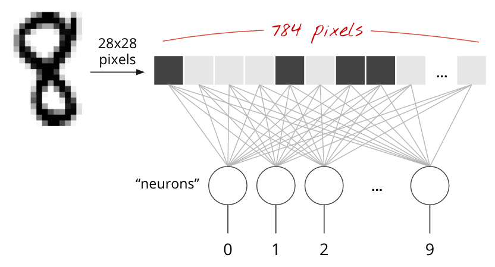
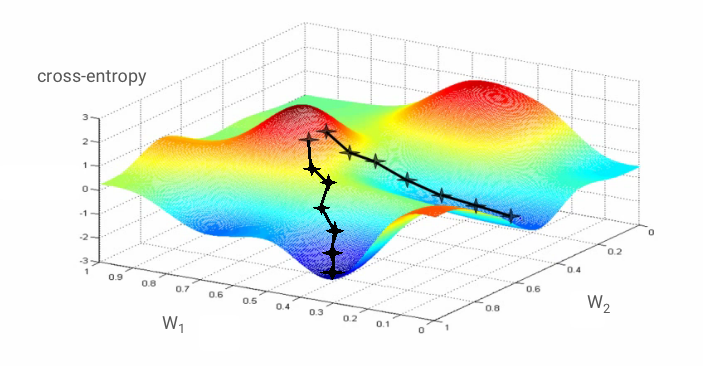

---
presentation:
  width: 1024
  height: 768
  controls: true
---
<!-- slide -->
# Recognize Handwritten Digits

> by Ray Cai
> April 15, 2017

<!-- slide -->
# Handwritten Digits


<!-- slide -->
# Neural Network

*Terminology:*
1. Neuron
2. perceptron
3. Neural Network

<!-- slide -->
# Neuron


<!-- slide -->
# Perceptron


<!-- slide -->
# Neural Network


<!-- slide -->
# 1 Layer Neural Network



<!-- slide -->
# Activation Function


<!-- slide -->
# Weights


<!-- slide -->
# Completed Formula


<!-- slide -->
# Loss Function
*The distance between actual result and prediction.*

> Any distance would work, the ordinary euclidian distance is fine but for classification problems one distance, called the "cross-entropy" is more efficient.

<!-- slide -->
# Cross Entropy


<!-- slide -->
# Formula

$$ Y = softmax(X . W + b) $$
$$ cross-entropy = - \sum{Y'_i . \log{Y_i}} $$

"Training" the neural network actually means using training images and labels to adjust weights and biases so as to minimise the cross-entropy loss function.  

<!-- slide -->
# Gradient


<!-- slide -->
# mnist_1.0_softmax.py
```python
import tensorflow as tf

X = tf.placeholder(tf.float32, [None, 28, 28, 1])
W = tf.Variable(tf.zeros([784, 10]))
b = tf.Variable(tf.zeros([10]))

init = tf.initialize_all_variables()
```

<!-- slide -->
# mnist_1.0_softmax.py
```python
# model
Y = tf.nn.softmax(tf.matmul(tf.reshape(X, [-1, 784]), W) + b)
# placeholder for correct labels
Y_ = tf.placeholder(tf.float32, [None, 10])

# loss function
cross_entropy = -tf.reduce_sum(Y_ * tf.log(Y))

# % of correct answers found in batch
is_correct = tf.equal(tf.argmax(Y,1), tf.argmax(Y_,1))
accuracy = tf.reduce_mean(tf.cast(is_correct, tf.float32))
```

<!-- slide -->
# mnist_1.0_softmax.py
```python
optimizer = tf.train.GradientDescentOptimizer(0.003)
train_step = optimizer.minimize(cross_entropy)
```

<!-- slide -->
# mnist_1.0_softmax.py
```python
sess = tf.Session()
sess.run(init)

for i in range(1000):
    # load batch of images and correct answers
    batch_X, batch_Y = mnist.train.next_batch(100)
    train_data={X: batch_X, Y_: batch_Y}

    # train
    sess.run(train_step, feed_dict=train_data)

    # success ?
    a,c = sess.run([accuracy, cross_entropy], feed_dict=train_data)

    # success on test data ?
    test_data={X: mnist.test.images, Y_: mnist.test.labels}
    a,c = sess.run([accuracy, cross_entropy], feed=test_data)
```

<!-- slide -->
# Demo

<!-- slide -->
# Reference
1. [TensorFlow and deep learning without a PhD](https://goo.gl/pHeXe7)
